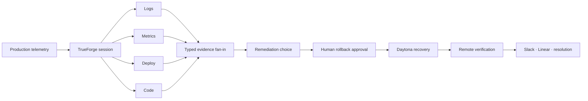

# PagerPilot

[](https://github.com/truefoundry/trueforge)
[](https://www.daytona.io/)
[](https://www.typescriptlang.org/)

> An AI incident responder that investigates production incidents, correlates evidence across operational systems, safely tests remediation, and requires human approval before irreversible production actions.

Built on the TrueForge agent harness, PagerPilot turns a production page into a parallel investigation, an evidence-correlated root cause, human-gated remediation, isolated Daytona recovery, and durable operational closeout.

## Technical map



| Deep dive | What it proves |
|---|---|
| [System architecture](docs/architecture.md) | Component and data-flow boundaries |
| [TrueForge surface map](docs/trueforge-surfaces.md) | Harness depth across 20 concrete capabilities |
| [Evidence contracts](docs/evidence-contracts.md) | Typed specialists and correlation gates |
| [Safety boundaries](docs/safety-boundaries.md) | Choice, approval, mutation, and recovery separation |
| [Durable remediation](docs/durable-remediation.md) | SQLite state machine and restart reconciliation |
| [Daytona execution](docs/daytona-execution.md) | Credential-isolated recovery pipeline |
| [Operator telemetry](docs/operator-telemetry.md) | Event-derived UI and replay trust rules |
| [Security model](docs/security-model.md) | Credential, input, and external-effect boundaries |
| [Qodo review impact](docs/qodo-impact.md) | Review findings translated into architecture |
| [Verification strategy](docs/verification-strategy.md) | Static, automated, live, and responsive proof |
| [Design decisions](docs/design-decisions.md) | Critical constraints and rejected shortcuts |

## Production incidents are now the code-review bottleneck

Engineering teams can generate code faster than they can safely operate it. During the first minutes of a production incident, a human still has to open PagerDuty, logs, metrics, deploy history, source code, Slack, and the runbook before they can explain what broke.

**PagerPilot owns that first response without taking control away from the operator.**

When checkout degrades, PagerPilot acknowledges the page, launches four isolated investigators in parallel, correlates their typed evidence, renders the root cause, synchronizes the operator checkpoint across the control room and Slack, pauses before every production write, executes an approved rollback in Daytona, verifies recovery, and closes the loop with the systems responders already use.

## The pitch

A production alert fires. Before the responder finishes opening their laptop, four TrueForge subagents are already reading error logs, service metrics, recent deploys, and changed source code in parallel. They converge on one evidence-linked diagnosis: a deploy introduced serial database writes in the checkout request path, driving p99 latency above six seconds and producing deadline failures. PagerPilot recommends rollback—but cannot act until a human chooses the path and approves the exact mutation. Approval resumes the same durable TrueForge session. Daytona reproduces the regression, creates and tests the revert, pushes it, verifies the remote SHA, and stops the sandbox. PagerPilot then publishes the result to Slack, records follow-up work, resolves the incident, and preserves the entire operational history for replay.

## Architecture

```text
┌─────────────────────────────────────────────────────────────────────────────────────────────┐
│                                   PRODUCTION CONTROL ROOM                                  │
│                                                                                             │
│  ┌───────────────────────────────┐       terminal trigger       ┌────────────────────────┐  │
│  │ LIVE PRODUCTION MONITOR       │ ───────────────────────────▶ │ LOCAL DEMO CONTROL     │  │
│  │ checkout-svc                  │                              │ state + Slack bridge   │  │
│  │ traffic · p99 · errors · logs │ ◀──── incident / recovery ── │ signed checkpoint URLs │  │
│  └───────────────────────────────┘                              └───────────┬────────────┘  │
│                                                                            │               │
│                              creates session + turn                         │               │
│                                                                            ▼               │
│  ┌───────────────────────────────────────────────────────────────────────────────────────┐  │
│  │                              TRUEFORGE AGENT HARNESS                                  │  │
│  │                                                                                       │  │
│  │  Saved agent · persistent SQLite sessions · SSE events · OpenAI GPT-5.6-sol          │  │
│  │  Git-backed runbook skill · dynamic subagents · ask-user · approval gates · OpenUI   │  │
│  │  sandbox-as-tool · Code Mode · large-response offload · SDK automation               │  │
│  │                                                                                       │  │
│  │       ┌────────────────┐  ┌────────────────┐  ┌────────────────┐  ┌──────────────┐    │  │
│  │       │ LOG ANALYZER   │  │ METRICS        │  │ DEPLOY         │  │ CODE BLAME   │    │  │
│  │       │ first failure  │  │ baseline/peak  │  │ suspect commit │  │ exact lines  │    │  │
│  │       └───────┬────────┘  └───────┬────────┘  └───────┬────────┘  └──────┬───────┘    │  │
│  │               └───────────────────┴──────────┬─────────┴──────────────────┘            │  │
│  │                                              ▼                                         │  │
│  │                                TYPED EVIDENCE FAN-IN                                   │  │
│  │                     temporal match · deploy agreement · symptom fit                    │  │
│  │                                              │                                         │  │
│  │                                              ▼                                         │  │
│  │                              RCA → CHOICE → APPROVAL GATE                              │  │
│  └──────────────────────────────────────────────┬────────────────────────────────────────┘  │
│                                                 │                                           │
│                         approved destructive MCP call                                       │
│                                                 ▼                                           │
│  ┌──────────────────────────────┐      ┌──────────────────────┐      ┌────────────────────┐ │
│  │ CHECKOUT-SVC-SIM MCP         │ ───▶ │ DAYTONA SANDBOX      │ ───▶ │ GITHUB             │ │
│  │ incident · logs · metrics    │      │ clone · reproduce    │      │ push revert        │ │
│  │ deploy · code · audit        │      │ revert · test · push │      │ verify remote SHA  │ │
│  │ Slack · rollback · resolve   │      │ verify · stop        │      │ permanent-fix PR   │ │
│  └──────────────────────────────┘      └──────────────────────┘      └────────────────────┘ │
│                                                 │                                           │
│                                                 ▼                                           │
│  ┌──────────────────────────────┐      ┌──────────────────────┐      ┌────────────────────┐ │
│  │ SLACK #pagerpilot-demo       │      │ LINEAR               │      │ PAGERDUTY SIM      │ │
│  │ investigation · checkpoints │      │ tested follow-up     │      │ acknowledge/resolve│ │
│  │ final RCA + recovery links   │      │ permanent guard     │      │ durable audit      │ │
│  └──────────────────────────────┘      └──────────────────────┘      └────────────────────┘ │
└─────────────────────────────────────────────────────────────────────────────────────────────┘
```

## Live demo

[](https://drive.google.com/file/d/1eHff5y28m-QIh7RG_nC9mRs4U8eneXUS/view?usp=sharing)

**[Open the full video demo →](https://drive.google.com/file/d/1eHff5y28m-QIh7RG_nC9mRs4U8eneXUS/view?usp=sharing)**

## TrueForge depth

PagerPilot uses the harness as the execution system—not as a model wrapper.

| TrueForge capability | How PagerPilot uses it |
|---|---|
| Custom MCP | Twelve incident, evidence, rollback, audit, and provider tools over Streamable HTTP |
| Multiple connectors | Custom incident MCP, official GitHub MCP, official Linear MCP |
| Dynamic subagents | Four sibling investigators launched together with isolated contexts |
| Typed subagent contracts | Invalid prose, missing evidence, and incomplete unknowns block correlation |
| Persistent sessions | Session, turns, checkpoints, and events survive browser and process reconnects |
| SSE streaming and replay | Live event ingestion plus deterministic replay into the command board |
| Ask-user | Remediation selection is a real paused TrueForge required action |
| Tool approval gates | Rollback, Slack, Linear, and resolution require explicit approval |
| Generative UI | Correlated RCA and remediation evidence render through native OpenUI |
| Sandbox-as-tool | Independent sandbox execution remains visible in the durable session |
| Daytona | Approved rollback runs in an ephemeral remote sandbox |
| Git-backed skill | The PagerPilot runbook is mounted from an immutable repository revision |
| Code Mode | Diagnostics can orchestrate awaited MCP calls inside the harness |
| Large-response offload | Oversized evidence is persisted outside the model context and retrieved intentionally |
| Saved reusable agent | `pagerpilot-incident-responder` is registered once and reused by UI, SDK, and terminal trigger |
| SDK automation | The trigger and replay pipeline create and drive real sessions programmatically |
| Embedded UI | The native TrueForge workbench exists as a separate operator route, not the product surface |

## Safety model

```text
READS                         HUMAN CHECKPOINTS                     WRITES
incident/logs/metrics  ──▶  remediation selection  ──▶  exact tool approval
source/deploy history       (not an execution grant)       │
                                                           ▼
                                                isolated preparation
                                                           │
                                                durable pre-push checkpoint
                                                           │
                                                           ▼
                                                  push + remote verify
```

Key constraints:

- No destructive action runs without native TrueForge approval.
- Slack delivery is approval-gated separately from rollback.
- A rollback in progress blocks incident resolution.
- SQLite transactions reserve one active remediation and prevent concurrent mutation.
- A restart compares remote HEAD with the approved deploy and persisted revert; any unrelated SHA becomes a conflict.
- Errors remain visible; the system does not turn missing evidence into success.

## Why this matters

The difficult part of an incident agent is not generating an RCA paragraph. It is building a system that can gather evidence concurrently, prove its causal chain, stop at the correct boundary, execute one approved change, recover safely after interruption, and leave behind a durable operational record.

PagerPilot demonstrates that an agent harness can own real incident work while the human retains final authority.

## Qodo code review: review findings became architecture

[](https://github.com/ElijahUmana/oncall-trueforge-hackathon/pull/1#issuecomment-5465097447)

Qodo was used as an adversarial engineering reviewer on [PR #1 — the TrueForge agent harness implementation](https://github.com/ElijahUmana/oncall-trueforge-hackathon/pull/1). Qodo's agentic review was triggered twice on the original implementation as it evolved. The resulting review found **six concrete bugs**—three high-severity reliability/correctness problems, one additional high-severity streaming problem, and two medium-severity integration problems. Those findings drove material changes to PagerPilot's persistence, concurrency, recovery, streaming, bootstrap, and authentication architecture.

**Public review evidence**

- [Full Qodo review summary: 6 bugs, 0 rule violations](https://github.com/ElijahUmana/oncall-trueforge-hackathon/pull/1#issuecomment-5465097447)
- [First agentic review request](https://github.com/ElijahUmana/oncall-trueforge-hackathon/pull/1#issuecomment-5464811180)
- [Follow-up agentic review request](https://github.com/ElijahUmana/oncall-trueforge-hackathon/pull/1#issuecomment-5465088702)
- [Qodo review on the exact implementation commit](https://github.com/ElijahUmana/oncall-trueforge-hackathon/pull/1#pullrequestreview-5059279230)

| Qodo finding | Risk identified by Qodo | Implemented response |
|---|---|---|
| [Rollback audit is non-atomic](https://github.com/ElijahUmana/oncall-trueforge-hackathon/pull/1#discussion_r3887777314) | A Git push could succeed before the audit record existed, leaving an unrecoverable mutation gap. | Split rollback into prepare/apply phases; persist operation intent, expected revert SHA, sandbox ID, and pre/post evidence before push; atomically record terminal state and audit. |
| [Rollback authorization can race](https://github.com/ElijahUmana/oncall-trueforge-hackathon/pull/1#discussion_r3887777317) | A concurrent resolution could change incident state while rollback was executing. | Added an incident-level remediation reservation, serialized active rollback, and blocked resolution until the operation reaches a terminal state. |
| [Incident state resets on restart](https://github.com/ElijahUmana/oncall-trueforge-hackathon/pull/1#discussion_r3887777318) | In-memory incident and audit state broke persistent TrueForge session recovery. | Replaced mutable in-memory state with transaction-backed SQLite for incidents, domain audits, rollback operations, attempts, evidence, and cleanup results. |
| [Truncated SSE looks successful](https://github.com/ElijahUmana/oncall-trueforge-hackathon/pull/1#discussion_r3887777320) | Unexpected EOF could be mistaken for a completed TrueForge turn. | Required an observed terminal `turn.done`, added bounded SSE reconnect/replay from the last sequence ID, suppressed duplicate events, and refused to persist incomplete completion state. |
| [Agent lookup ignores pagination](https://github.com/ElijahUmana/oncall-trueforge-hackathon/pull/1#discussion_r3887777322) | Repeated bootstrap could create duplicate saved agents when the existing agent was not on page one. | Reused full pagination semantics when discovering the saved agent before create/update. |
| [Operator omits bearer authentication](https://github.com/ElijahUmana/oncall-trueforge-hackathon/pull/1#discussion_r3887777325) | A protected TrueForge deployment could not be reached safely from the browser. | Added a trusted same-origin proxy that injects the bearer token server-side for API and SSE traffic; no credential enters the browser bundle. |

The largest outcome was the durable remediation state machine introduced in [`cf2ccc9`](https://github.com/ElijahUmana/oncall-trueforge-hackathon/commit/cf2ccc9): rollback is now reserved, prepared, checkpointed, applied, remotely reconciled, and audited across process failure. Client reliability and secure operator authentication landed in [`cbe9696`](https://github.com/ElijahUmana/oncall-trueforge-hackathon/commit/cbe9696) and [`7fc8dfa`](https://github.com/ElijahUmana/oncall-trueforge-hackathon/commit/7fc8dfa). Focused durability, transport, restart, proxy, pagination, and SSE tests preserve the fixes.

[Read the detailed Qodo impact analysis →](docs/qodo-impact.md)

## Credits

PagerPilot is based on [the original TrueForge incident-response project](https://github.com/ElijahUmana/oncall-trueforge-hackathon) by [Elijah Umana](https://github.com/ElijahUmana), who designed and built its architecture, safety model, durable remediation, and operator UI. The Qodo review history and commit links above point to that original repository.
